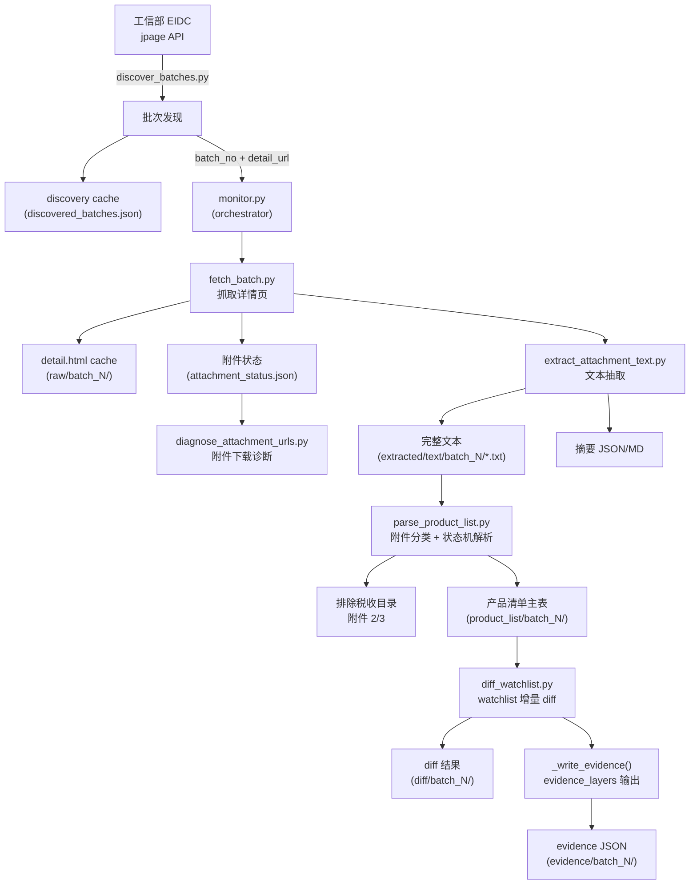

# MIIT 模块摸排报告

> 生成日期: 2026-06-22
> 版本: V0.3.3
> 性质: 只读扫描，未修改任何文件

---

## 1. 当前结论摘要

1. **MIIT 模块已完成 7 个版本迭代**（V0.1 → V0.3.3），从一次性爬虫演进为包含 11 个 Python 模块、12 个 Makefile 命令、78 个测试的独立官方信源接入子系统。

2. **核心能力已站稳**：公告批次发现 → 详情页/附件抓取 → DOC/DOCX 文本抽取 → 产品清单结构化 → watchlist 增量 diff → evidence 证据输出，全链路可运行。

3. **已做生产级加固**：HTTP 重试与指数 backoff、discovery cache fallback、detail page cache fallback、证据 schema 版本校验、幂等复用、附件诊断、product_list quality gate。

4. **真实数据已验证**：第 407 批（正式发布）可解析 1111 条产品记录 / 469 家企业 / 939 个型号前缀，quality=usable。第 408 批（公示）可完成全链路。

5. **深度结构化尚未开始**：续航、电池、电机、尺寸等深度参数仍在 DOC 中未解析。税收目录（附件 2/3）仅排除不做解析。

6. **测试覆盖充分**：78 个测试覆盖了批次号解析、状态识别、watchlist 匹配、diff 结构、cache fallback、evidence schema、附件诊断、文本抽取、product_list 解析、evidence_layers。

7. **文档中等**：有 README（264 行）和 AGENTS.md 说明，但缺乏架构图、数据字典、promptbuilder 草案。

---

## 2. 已发现的文件与模块

### 2.1 核心脚本（11 个文件，共 ~3077 行 Python）

| 文件路径 | 行数 | 类型 | 作用 | 是否核心 | 备注 |
|----------|------|------|------|----------|------|
| `research_scripts/miit_new_car/__init__.py` | 1 | 模块入口 | 模块标记 | 否 | 空包 |
| `research_scripts/miit_new_car/http_utils.py` | 139 | 工具 | HTTP 请求（重试/backoff/NetworkError） | 是 | 被所有脚本依赖 |
| `research_scripts/miit_new_car/discover_batches.py` | 333 | 发现 | 访问 jpage API 发现最新批次 | 是 | jpage XML → 《第 n 批》 |
| `research_scripts/miit_new_car/fetch_batch.py` | 279 | 抓取 | 抓取详情页 HTML、解析附件链接、下载附件 | 是 | 支持 detail.html cache |
| `research_scripts/miit_new_car/diagnose_attachment_urls.py` | 220 | 诊断 | 对每个附件 URL 做下载诊断 | 是 | failure_type 分类 |
| `research_scripts/miit_new_car/extract_attachment_text.py` | 320 | 抽取 | .html/.txt/.docx/.doc → 纯文本 | 是 | 策略: html_strip/docx_zip/textutil 等 |
| `research_scripts/miit_new_car/check_text_extractors.py` | 99 | 检测 | 检测 textutil/antiword/catdoc/libreoffice | 是 | macOS 首选 textutil |
| `research_scripts/miit_new_car/parse_products.py` | 286 | 解析 | HTML 表格 → 结构化记录（遗留） | 次 | V0.1 遗留，保留兼容 |
| `research_scripts/miit_new_car/parse_product_list.py` | 603 | 解析 | 附件分类 + 状态机解析 → 产品清单主表 | 是 | V0.3.3 核心，含 classify/state machine |
| `research_scripts/miit_new_car/diff_watchlist.py` | 249 | 对比 | 与上一批 watchlist 做增量 diff | 是 | matched_keyword/matched_text |
| `research_scripts/miit_new_car/monitor.py` | 548 | 编排 | 串联全流程 + evidence_layers | 是 | 主入口 |

### 2.2 配置文件

| 文件路径 | 作用 | 是否核心 |
|----------|------|----------|
| `configs/重点关注新能源品牌.json` | 14 个重点品牌 watchlist（智己/理想/问界/小米/蔚来/小鹏/极氪/阿维塔/深蓝/零跑/腾势/方程豹/比亚迪/特斯拉） | 是 |

### 2.3 入口命令（Makefile）

| Target | 脚本 | 用途 |
|--------|------|------|
| `miit-discover-latest-batch` | `discover_batches.py --limit 5` | 打印最新批次 |
| `miit-discover-batches PAGES=N` | `discover_batches.py --pages N` | 多页发现 |
| `miit-fetch-batch BATCH=N` | `monitor.py --batch N` | 抓取指定批次 |
| `miit-new-car-monitor` | `monitor.py --latest` | 监控最新批次 |
| `miit-latest-publicity` | `monitor.py --latest-publicity` | 最新公示（幂等） |
| `miit-latest-official` | `monitor.py --latest-official` | 最新正式公告（幂等） |
| `miit-latest-publicity-refresh` | `monitor.py --latest-publicity --refresh` | 刷新最新公示 |
| `miit-latest-official-refresh` | `monitor.py --latest-official --refresh` | 刷新最新正式公告 |
| `miit-extract-text BATCH=N` | `extract_attachment_text.py --batch N` | 附件文本抽取 |
| `miit-check-text-extractors` | `check_text_extractors.py` | 检查文本抽取工具 |
| `miit-diagnose-attachments BATCH=N` | `diagnose_attachment_urls.py --batch N` | 附件下载诊断 |
| `miit-parse-product-list BATCH=N` | `parse_product_list.py --batch N` | 解析产品清单主表 |

### 2.4 测试

| 文件路径 | 测试数 | 覆盖范围 |
|----------|--------|----------|
| `tests/test_miit_new_car.py` | 78 | 批次号解析、状态识别、watchlist 匹配、diff、cache fallback、evidence schema、附件诊断、文本抽取、product_list、evidence_layers |

### 2.5 文档

| 文件路径 | 行数 | 说明 |
|----------|------|------|
| `research_scripts/miit_new_car/README.md` | 264 | 完整使用说明、输出目录、已知限制 |
| `AGENTS.md` | 多处 | MIIT 能力定位、常用命令、输出目录 |
| `workspace README.md` | 2 行 | research_scripts 计数 + 使用示例 |
| `docs/project_inventory.md` | 1 行 | MIIT 条目 |

### 2.6 输出资产

| 目录 | 内容 | 是否 gitignore |
|------|------|---------------|
| `outputs/miit_new_car/raw/` | 原始 HTML 和附件 DOC | 是 |
| `outputs/miit_new_car/discovery/` | 批次发现缓存 JSON/MD | 否 |
| `outputs/miit_new_car/parsed/` | 结构化记录 CSV/JSON/MD | 否 |
| `outputs/miit_new_car/product_list/` | 产品清单主表 CSV/JSON/MD | 否 |
| `outputs/miit_new_car/extracted/` | 附件文本抽取 JSON/MD | 否 |
| `outputs/miit_new_car/extracted/text/` | 完整文本文件 (.txt) | 否 |
| `outputs/miit_new_car/diagnostics/` | 附件诊断 JSON/MD | 否 |
| `outputs/miit_new_car/diff/` | watchlist diff JSON/MD | 否 |
| `outputs/miit_new_car/evidence/` | official source evidence JSON | 否 |
| `outputs/miit_new_car/state/` | 最新处理批次记录 | 否 |

---

## 3. 当前数据流 / 执行链路



### 执行步骤

| 步骤 | 脚本 | 输入 | 输出 |
|------|------|------|------|
| 1. 批次发现 | `discover_batches.py` | jpage API URL | `discovery/discovered_batches.json` |
| 2. 详情抓取 | `fetch_batch.py` | batch_no / detail_url | `raw/batch_N/detail.html`, `metadata.json`, `links.json` |
| 3. 附件下载 | `fetch_batch.py` | links.json URLs | `raw/batch_N/attachments/*` + `attachment_status.json` |
| 4. 附件诊断 | `diagnose_attachment_urls.py` | attachments list | `diagnostics/batch_N_attachment_diagnostics.json` |
| 5. 文本抽取 | `extract_attachment_text.py` | attachments/* | `extracted/batch_N_attachment_text.*` + `extracted/text/batch_N/*.txt` |
| 6. 结构化记录 | `parse_products.py` (legacy) | attachments/*.html | `parsed/batch_N_products.*` |
| 7. 产品清单 | `parse_product_list.py` | extracted/text/*.txt | `product_list/batch_N_product_list.*` |
| 8. Watchlist diff | `diff_watchlist.py` | product_list.json + watchlist.csv | `diff/batch_N_watchlist_diff.*` |
| 9. Evidence 输出 | `monitor.py`/`_write_evidence()` | 上述所有产物 | `evidence/batch_N_official_source_evidence.json` |

---

## 4. Makefile / CLI 入口

### 主要命令

```bash
# 发现
make miit-discover-latest-batch           # 打印最新 5 批
make miit-discover-batches PAGES=3        # 多页发现（默认 1 页）

# 监控（幂等）
make miit-latest-publicity                # 最新公示（evidence 存在则复用）
make miit-latest-official                 # 最新正式公告（evidence 存在则复用）
make miit-new-car-monitor                 # 最新批次（按 batch_no 最大）

# 监控（刷新）
make miit-latest-publicity-refresh        # 刷新最新公示
make miit-latest-official-refresh         # 刷新最新正式公告

# 诊断/抽取/解析
make miit-extract-text BATCH=407          # 附件文本抽取
make miit-check-text-extractors           # 检查文本抽取工具
make miit-diagnose-attachments BATCH=407  # 附件下载诊断
make miit-parse-product-list BATCH=407    # 解析产品清单主表
```

### CLI 参数

所有脚本均支持 `--format terminal|json`。
`monitor.py` 额外支持 `--refresh` / `--force-refresh`。
`discover_batches.py` 额外支持 `--publicity` / `--official` / `--pages N`。

---

## 5. 数据与输出资产

### 输入依赖

| 依赖 | 来源 | 稳定性 |
|------|------|--------|
| jpage API (`dataproxy.jsp`) | 工信部 EIDC | ⚠️ 可能改版，CDATA 格式稳定 |
| 详情页 (`/art/...`) | 工信部 EIDC | ✅ 稳定 HTML 结构 |
| 附件 DOC/HTML | miit.gov.cn / miit-eidc.org.cn | ⚠️ 部分 URL 返回 404 |
| watchlist CSV | 本地配置 | ✅ |

### 缓存/中间产物

| 路径 | 用途 | 可重建 |
|------|------|--------|
| `raw/batch_N/detail.html` | 详情页 HTML 缓存 | 是 |
| `raw/batch_N/attachments/*.doc` | 原始附件 | 是 |
| `discovery/discovered_batches.json` | 批次发现缓存 | 是 |
| `extracted/text/batch_N/*.txt` | 完整抽取文本 | 是（需工具链） |

### 结构化输出

| 路径 | 格式 | 关键字段 |
|------|------|----------|
| `product_list/batch_N_product_list.json` | JSON（含 summary + records） | enterprise_name, brand, product_name, product_model, quality |
| `parsed/batch_N_products.json` | JSON array | 遗留结构化记录 |
| `diff/batch_N_watchlist_diff.json` | JSON | matched_products, new_products |
| `evidence/batch_N_official_source_evidence.json` | JSON | evidence_layers, attachment_summary |

---

## 6. 测试与文档覆盖

### 测试覆盖

| 领域 | 测试数 | 状态 |
|------|--------|------|
| 批次号提取 | 6 | ✅ |
| 状态识别 | 3 | ✅ |
| discovery cache | 3 | ✅ |
| detail cache | 2 | ✅ |
| watchlist | 9 | ✅ |
| 附件诊断 | 8 | ✅ |
| 文本抽取 | 6 | ✅ |
| product_list | 7 | ✅ |
| evidence/structure/schema | 9 | ✅ |
| 网络错误 | 3 | ✅ |
| monitor summary | 3 | ✅ |
| **合计** | **78** | ✅ |

### 文档覆盖

| 文档 | 位置 | 质量 |
|------|------|------|
| README | `miit_new_car/README.md` | 中等，有使用说明、命令、输出目录、已知限制 |
| AGENTS.md | `mashang_workspace/AGENTS.md` | 适中，有能力定位和常用命令 |
| workspace README | `mashang_workspace/README.md` | 简单，仅入口说明 |
| project_inventory | `docs/project_inventory.md` | 简单，仅 1 行 |
| **缺乏** | | **架构图、数据字典、promptbuilder 草案** |

---

## 7. 当前能力边界

### 已具备

- ✅ 自动发现最新公示/正式公告批次（jpage API）
- ✅ 多页回溯发现历史批次（最多 3 页，~45 条）
- ✅ 详情页抓取 + 附件链接解析 + 附件下载
- ✅ HTTP 重试与指数 backoff
- ✅ discovery cache fallback + detail page cache fallback
- ✅ 附件下载诊断（failure_type 分类）
- ✅ DOC/DOCX 文本抽取（textutil / zipfile）
- ✅ HTML 表格结构化解析
- ✅ 产品清单主表解析（企业名/品牌/产品名/型号前缀）
- ✅ 附件类型分类（road_product / tax 排除）
- ✅ Watchlist 增量 diff
- ✅ evidence_layers 三层输出 + schema 版本校验
- ✅ 幂等复用（证据存在且 schema 匹配则跳过）
- ✅ 12 个 Makefile 命令、78 个测试

### 部分具备

- 🔶 **DOC 解析**: 文本抽取可用（依赖 textutil），但非结构化。状态机仅能解析 tab/\x07 分隔的表格，内容完整性取决于 textutil 输出质量
- 🔶 **产品清单品质**: enterprise_count + model_count > 0 即 quality=usable，未做企业名合法性验证
- 🔶 **附件下载**: miit.gov.cn 域附件在当前环境 404，仅记录 warning

### 尚未具备

- ❌ **深度车型参数**: 续航、电池、电机、尺寸、燃料类型等未解析
- ❌ **税收目录解析**: 附件 2/3 仅排除，不做 vehicle_vessel_tax_catalog / purchase_tax_catalog 结构化
- ❌ **自动定时任务**: 无 cron / GitHub Actions 定期执行
- ❌ **飞书/邮件通知**: 无 watchlist 命中主动推送
- ❌ **与 auto_launch_monitor 联动**: 只输出 evidence 文件，未触发下游
- ❌ **历史数据回填**: 第 300 批之前的批次未做

---

## 8. Promptbuilder 落盘建议

MIIT 项目如果先做 Promptbuilder，建议优先沉淀以下 prompt 模块：

### 优先级 P0（核心流程，立即可做）

| Prompt 模块 | 描述 | 输入 | 输出 |
|------------|------|------|------|
| **批次扫描 Prompt** | 检测最新公示/正式公告批次 | jpage XML 或 discovery cache | `{batch_no, status, publish_date, detail_url}` |
| **车型信息抽取 Prompt** | 从 DOC 文本中提取企业/品牌/产品名/型号 | `extracted/text/batch_N/*.txt` | 结构化记录列表 |
| **新旧版本差异 Prompt** | 对比两批 product_list，识别新增/消失车型 | 两批 product_list.json | 差异列表（新增/消失/变更） |

### 优先级 P1（增强能力，建议随后做）

| Prompt 模块 | 描述 | 输入 | 输出 |
|------------|------|------|------|
| **产品意图解读 Prompt** | 判断某车型是全新/改款/年度/扩展 | 车型名称 + 产品名 + 型号 | `{intent: new|refresh|extension|unknown}` |
| **竞品映射 Prompt** | 将公告车型映射到 watchlist 品牌 | 企业名 + 产品名 | `{brand, confidence, reason}` |
| **威胁等级判断 Prompt** | 判断竞品车型对 LS6/LS8/LS9 的威胁程度 | 车型参数 + 细分市场 | `{threat_level: high|medium|low}` |

### 优先级 P2（可选，后续做）

| Prompt 模块 | 描述 |
|------------|------|
| **MIIT 月度情报简报 Prompt** | 按月汇总 MIIT 发现的关注品牌新产品，生成简报 |
| **深度参数抽取 Prompt** | 从税收目录中抽取续航/电量/能耗等参数 |
| **公告叙事 Prompt** | 将公告技术变更转化为市场叙事（如"智己获得增程路线资质"） |

---

## 9. 下一步建议

### 最小改动路线（不改核心代码）

| 优先级 | 动作 | 产出 |
|--------|------|------|
| 1 | 新增 `docs/miit_promptbuilder_draft.md` | 将上述 Prompt 模块写成可执行的 prompt 模板 |
| 2 | 补充 README 新增 "Promptbuilder 接入指南" 一节 | 说明如何用 OpenCode / Claude Code 通过 prompt 读取现有输出文件 |
| 3 | 生成 `inventory/miit_capability_registry.json` | 列出当前所有脚本、参数、输出格式，供 promptbuilder 发现能力 |

### 继续工程化的风险

如果需要继续工程化（V0.4+），当前最大的风险是：

1. **附件 404 是地区性网络问题**，非代码能修复。继续深化附件下载工程化的边际收益递减。
2. **DOC 文本抽取依赖 textutil**，非 Python 生态，跨平台不一致。如果要在 Linux CI 上运行，需要额外配置。
3. **jpage API 可能改版**，当前依赖 CDATA XML 格式。如果 EIDC 网站改版，`discover_batches.py` 需要重写。
4. **部分内容已经够用**（产品清单 1111 条 / 469 企业），不建议继续投入优化解析覆盖率。
