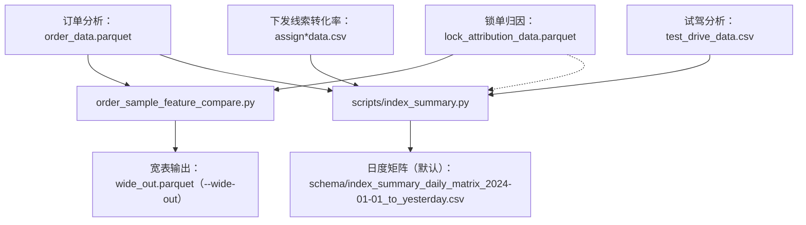

下发线索转化率：/Users/zihao\_/Documents/github/mashang-service：0.1/dataset/assign_data.csv
试驾分析：/Users/zihao\_/Documents/github/mashang-service：0.1/dataset/test_drive_data.csv
订单分析：/Users/zihao\_/Documents/github/mashang-service：0.1/dataset/order_data.parquet
锁单归因：/Users/zihao\_/Documents/github/mashang-service：0.1/dataset/lock_attribution_data.parquet
选配信息：/Users/zihao\_/Documents/github/mashang-service：0.1/dataset/config_attribute.parquet
正反向对比：/Users/zihao\*/Documents/coding/dataset/original/业务数据记录\_竞争PK（正反向排名）.csv

---

智己大区分布：/Users/zihao\_/Documents/coding/dataset/original/store_region_business_definition_data.csv

---

