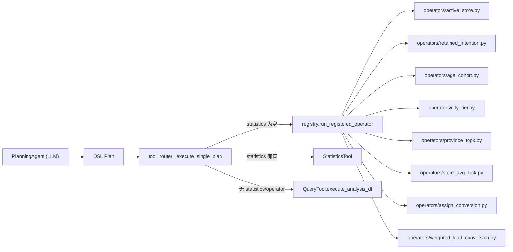

下发线索转化率：/Users/zihao\_/Documents/github/mashang-service/dataset/assign_data.csv
试驾分析：/Users/zihao\_/Documents/github/mashang-service/dataset/test_drive_data.csv
订单分析：/Users/zihao\_/Documents/github/mashang-service/dataset/order_data.parquet
锁单归因：/Users/zihao\_/Documents/github/mashang-service/dataset/lock_attribution_data.parquet
选配信息：/Users/zihao\_/Documents/github/mashang-service/dataset/config_attribute.parquet
微信群聊：/Users/zihao\_/Documents/github/mashang-service/dataset/wechat/*.parquet
正反向对比：/Users/zihao\*/Documents/coding/dataset/original/业务数据记录\_竞争PK（正反向排名）.csv
智己大区分布：/Users/zihao\_/Documents/coding/dataset/original/store_region_business_definition_data.csv

---

### 运行时算子架构

路由优先级（`tool_router._execute_single_plan`）：
1. **Fast Path**（`FastPathTool`）：数字计算、数据更新、闲聊
2. **固定算子**（`registry.run_registered_operator`）：匹配到算子立即执行，不生成 DSL
3. **Statistics**（`StatisticsTool`）：趋势汇总、日均、分位排名等统计型
4. **通用 DSL**（`QueryTool.execute_analysis_df`）：通用 filter + agg 查询

支持的算子清单见 `operators/index_summary.json`，由 `registry.get_operator_catalog_md()` 自动注入 LLM 提示词。
