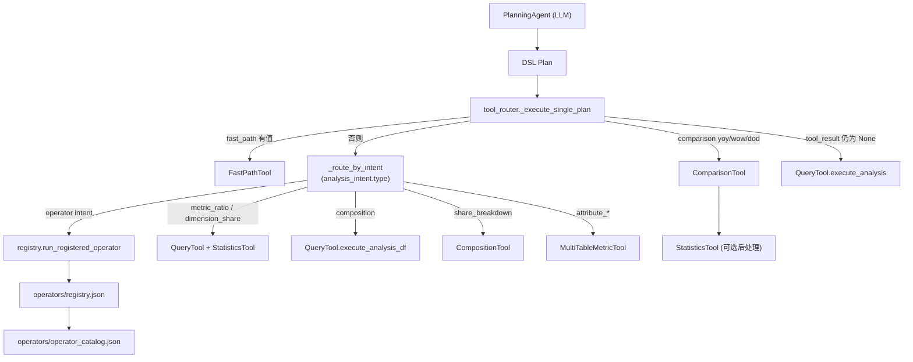

下发线索转化率：/Users/zihao\_/Documents/github/mashang-service/dataset/assign_data.csv
试驾分析：/Users/zihao\_/Documents/github/mashang-service/dataset/test_drive_data.csv
订单分析：/Users/zihao\_/Documents/github/mashang-service/dataset/order_data.parquet
锁单归因：/Users/zihao\_/Documents/github/mashang-service/dataset/lock_attribution_data.parquet
选配信息：/Users/zihao\_/Documents/github/mashang-service/dataset/config_attribute.parquet
微信群聊：/Users/zihao\_/Documents/github/mashang-service/dataset/wechat/\*.parquet
正反向对比：/Users/zihao\*/Documents/coding/dataset/original/业务数据记录\_竞争PK（正反向排名）.csv
智己大区分布：/Users/zihao\_/Documents/coding/dataset/original/store_region_business_definition_data.csv
门店信息（门店代码/名称/城市/大区/类型/开业时间/停业时间）：/Users/zihao\_/Documents/coding/dataset/original/store_info.csv

---

### 运行时算子架构

路由优先级（`tool_router._execute_single_plan`，line 422-1347）：

1. **Fast Path**（`FastPathTool`）：数字计算、数据更新、闲聊
2. **\_route_by_intent**（按 `plan.analysis_intent.type` 分发）：
   - **固定算子**（`registry.run_registered_operator`）：匹配到算子立即执行，不生成 DSL
   - **metric_ratio / dimension_share**：QueryTool 取数 + 可选 StatisticsTool 后处理
   - **composition**：QueryTool.execute_analysis_df 通用查询
   - **share_breakdown**：CompositionTool
   - **attribute_penetration / attribute_distribution**：MultiTableMetricTool
3. **Comparison**（`ComparisonTool`）：同比/环比/周同比
4. **Statistics**（`StatisticsTool`，包括 operator 结果的趋势后处理）：趋势汇总、日均、分位排名等
5. **通用 DSL fallback**（`QueryTool.execute_analysis`）：兜底通用 filter + agg 查询

支持的算子清单见 `operators/operator_catalog.json`，由 `registry.get_operator_catalog_md()` 自动注入 LLM 提示词。
